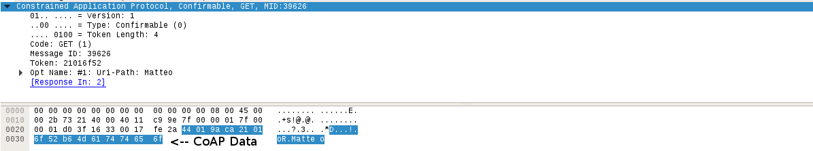
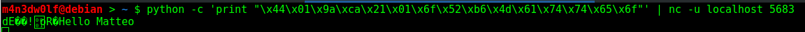

# CoAP Spoofing Docs



## Raw CoAP payload
```
\x44\x01\x9a\xca\x21\x01\x6f\x52\xb6\x4d\x61\x74\x74\x65\x6f
```
**\x44** = 01000100 = Version (01), Type(00) and Token Length (0100)

**\x01** = 01 = Code

**\x9a\xca** = 39626 (Decimal) = MessageID

**\x21\x01\x6f\x52** = Token

**\xb6** = 10110110 = Options Delta (1011) and Options Length (0110) 

**\x4d\x61\x74\x74\x65\x6f** = Resource URI = Matteo (ASCII) = 6 characters declared in Options Length (0110 = 6)

Information about the CoAP Packet layout can be found [here](lwm2m-communication.md#coap-packet-analysis)
	
## Replaying the bytes with python and netcat



Notice that we get the same result, so after we intercept a token we can send and receive in name of device.
