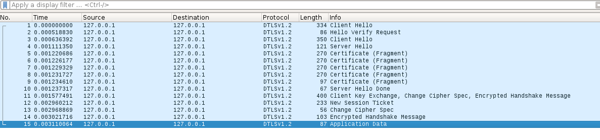

# Library Installation

```
$ git clone https://github.com/m4n3dw0lf/pydtls

$ cd pydtls

$ python setup.py sdist

$ sudo pip install dist/*

```
<br>

# Generate OpenSSL Key and Cert

`$ openssl req -x509 -nodes -days 365 -newkey rsa:2048 -keyout cert.key -out cert.crt -subj '/CN=fiware-orion/O=fiware/C=BR'`

<br>

# Run Server

```
$ python dtls_server.py 
DTLS Server listening on port 5683
```

# Run Client

```
$ python dtls_client.py
```

# Check the message on the server

```
$ python dtls_server.py
DTLS Server listening on port 5683
message: Hi there
```



