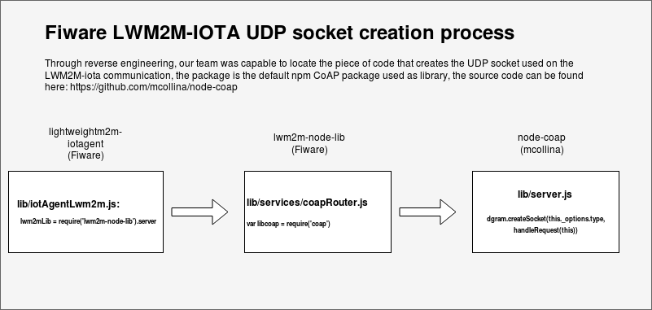
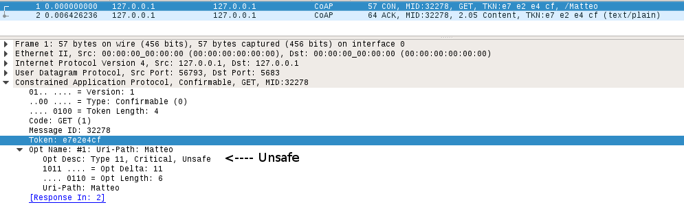
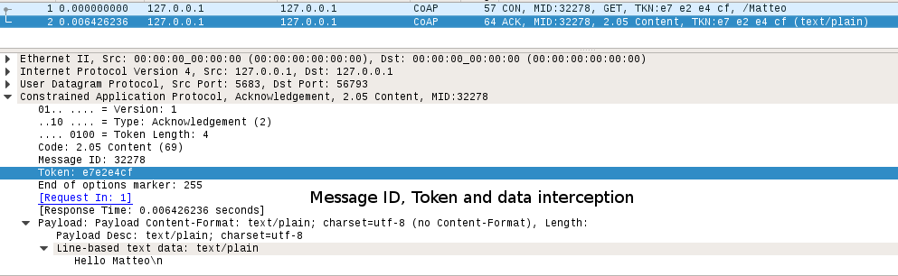

# LWM2M and CoAP Communication docs.

## Fiware LMWM2-IOTA UDP Socket creation process

Notice that the weakness of packet intercepting in this LWM2M implementation happens because the nodejs doesn't have untill now a default CoAP library that has a DTLS solution implemented.

### Result in Plain-Text LWM2M Packets capture

#### CoAP Client request

#### CoAP Server response

#### The interception of those data (mainly the token) allow attacks on the CoAP protocol such as CoAP spoofing, described [here](coap-spoofing.md)

## CoAP packet analysis

| Version (2-bit) | Transaction Type (2-bit) | Token Length (4-bit) | Code (8-bits) |
| - | - | - | - |
| **Value**:   1   (Other values   are reserved  for future use)   | **Values:**   0 = CON   1 = NON   2 = ACK   3 = RST | **Values:**   0-8,  (lengths 9-15   are reserved  for future) | **Values**:   1 = GET   2 = POST   3 = PUT   4 = DELETE
| **MessageID (16-bits)**| **Token** | **Options (if any)** | **Payload (if any)** |
|16 bits random value| Fill with random   bits matching  the declared   Token Length | [CoAP Options   RFC](https://tools.ietf.org/html/rfc7252#page-18)   if none = 255 (FF) | Data

# To be continued
